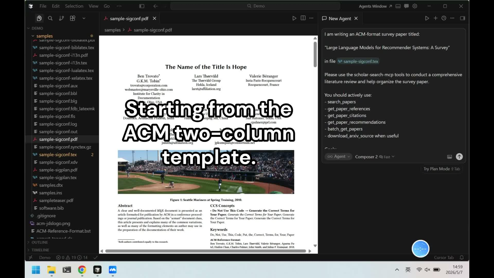

# Scholar Search MCP

An MCP server for academic literature workflows in Claude, Cursor, and other MCP clients.

It combines **Semantic Scholar + arXiv** into one unified toolset, with fast parallel search, normalized outputs, source-aware deduplication, and practical research utilities (citations, references, author graph, recommendations, and arXiv source download).

---

## Table of Contents

- [Why this project](#why-this-project)
- [What you get](#what-you-get)
- [Demo videos](#demo-videos)
- [Source strategy](#source-strategy)
- [Install](#install)
- [Quick setup (Claude Desktop)](#quick-setup-claude-desktop)
- [Quick setup (Cursor)](#quick-setup-cursor)
- [Environment variables](#environment-variables)
- [Tool list](#tool-list)
- [Testing with MCP Inspector](#testing-with-mcp-inspector)
- [Contributing](#contributing)
- [License](#license)

---

## Why this project

Most paper tools force you to choose one source or one API style. `scholar-search-mcp` focuses on a simple goal:

- **One MCP server, multiple scholarly sources**
- **Free-first defaults** (`arXiv` works without keys)
- **LLM-friendly outputs** for downstream reasoning and agent workflows
- **Practical research actions**, not only search

If you use AI agents for research, this gives you a cleaner and more reliable paper retrieval layer.

## What you get

- **Unified search (`search_papers`)**
  - Queries Semantic Scholar and arXiv in parallel
  - Merges and deduplicates results by normalized title
  - Keeps richer metadata when overlaps occur
- **Rich paper graph operations**
  - Paper details, citations, references, author profile, author papers, recommendations
- **Batch retrieval**
  - Fetch up to 500 papers in one call (`batch_get_papers`)
- **arXiv source workflow**
  - Download and safely extract LaTeX/source tarballs via `download_arxiv_source`
- **Built-in response caching**
  - Improves repeated query latency and reduces API pressure
- **Channel control by env vars**
  - Turn Semantic Scholar / arXiv on or off without code changes

## Demo videos

Agent writes a survey paper with Scholar Search MCP.

   <a href="https://youtu.be/C81rVeznoRY"></a>

<br>

## Source strategy

Current built-in sources:

- **Semantic Scholar** (metadata-rich, optional API key for better limits)
- **arXiv** (open and key-free)

Design principle:

1. Prefer open/public access paths first.
2. Support optional API keys when they improve stability or rate limits.
3. Keep outputs consistent for LLM consumption across different upstreams.

## Install

```bash
pip install scholar-search-mcp
```

> Requires Python 3.10+.

## Quick setup (Claude Desktop)

Config file locations:

- **macOS**: `~/Library/Application Support/Claude/claude_desktop_config.json`
- **Windows**: `%APPDATA%\Claude\claude_desktop_config.json`
- **Linux**: `~/.config/Claude/claude_desktop_config.json`

Minimal config:

```json
{
  "mcpServers": {
    "scholar-search": {
      "command": "python",
      "args": ["-m", "scholar_search_mcp"],
      "env": {
        "SCHOLAR_SEARCH_ENABLE_SEMANTIC_SCHOLAR": "true",
        "SCHOLAR_SEARCH_ENABLE_ARXIV": "true"
      }
    }
  }
}
```

Recommended (with optional Semantic Scholar key):

```json
{
  "mcpServers": {
    "scholar-search": {
      "command": "python",
      "args": ["-m", "scholar_search_mcp"],
      "env": {
        "SEMANTIC_SCHOLAR_API_KEY": "your-key",
        "SCHOLAR_SEARCH_ENABLE_SEMANTIC_SCHOLAR": "true",
        "SCHOLAR_SEARCH_ENABLE_ARXIV": "true"
      }
    }
  }
}
```

## Quick setup (Cursor)

Add an MCP server in Cursor with the same:

- `command`: `python`
- `args`: `["-m", "scholar_search_mcp"]`
- `env`: same variables as above

## Environment variables

| Variable | Description |
| --- | --- |
| `SEMANTIC_SCHOLAR_API_KEY` | Optional. Increases Semantic Scholar rate limits. |
| `SCHOLAR_SEARCH_ENABLE_SEMANTIC_SCHOLAR` | `true/false`, default `true`. |
| `SCHOLAR_SEARCH_ENABLE_ARXIV` | `true/false`, default `true`. |
| `SCHOLAR_SEARCH_CACHE_DIR` | Optional cache directory path. |
| `SCHOLAR_SEARCH_CACHE_TTL_SECONDS` | Cache TTL in seconds, default `86400`. |
| `SCHOLAR_ARXIV_SOURCE_DIR` | Default parent directory for extracted arXiv sources. |

Example: run arXiv-only mode

```json
{
  "SCHOLAR_SEARCH_ENABLE_SEMANTIC_SCHOLAR": "false",
  "SCHOLAR_SEARCH_ENABLE_ARXIV": "true"
}
```

## Tool list

| Tool | Purpose |
| --- | --- |
| `search_papers` | Search papers with optional `limit`, `fields`, `year`, `venue`. |
| `get_paper_details` | Get one paper by DOI, arXiv ID, S2 ID, or URL. |
| `get_paper_citations` | Get papers that cite a given paper. |
| `get_paper_references` | Get references of a given paper. |
| `get_author_info` | Get an author profile by ID. |
| `get_author_papers` | Get papers by a given author. |
| `get_paper_recommendations` | Get similar paper recommendations. |
| `batch_get_papers` | Batch fetch paper details (up to 500 IDs). |
| `download_arxiv_source` | Download and extract arXiv source bundle (`tar.gz`). |

## Testing with MCP Inspector

```bash
npm install -g @modelcontextprotocol/inspector
mcp-inspector python -m scholar_search_mcp
```

## Contributing

Issues and pull requests are welcome.

If you want to contribute:

1. Fork the repo
2. Create a feature branch
3. Add tests or reproducible validation steps
4. Open a PR with clear before/after behavior

## License

MIT

## References

- [Semantic Scholar API Docs](https://api.semanticscholar.org/api-docs)
- [arXiv API User Manual](https://info.arxiv.org/help/api/user-manual.html)

